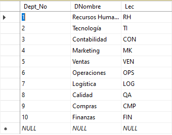
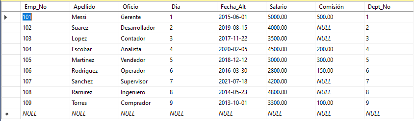
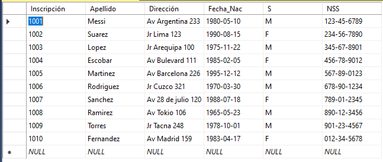
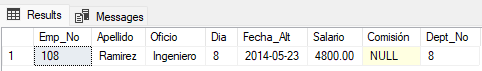
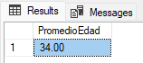
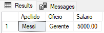
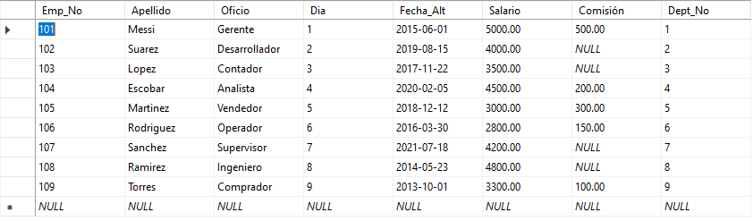

# ENTREGABLE 01 😄
## DATA BASE CLINICA
1. Ejecutar operaciones básicas tipo DCL y TCL para crear procedimientos y
funciones
2. Crear restricciones al modelo de BD, para asegurar la calidad de la
información

## PASOS PARA CREAR LA DATA BASE
### Creamos las tablas para hacer las relaciones
Creamos las tablas: Dept, Emp y Emfermo
```sql
-- CREAR TABLAS
CREATE TABLE Dept (
    Dept_No INT PRIMARY KEY,
    DNombre VARCHAR(50) NOT NULL,
    Lec VARCHAR(50)
);

CREATE TABLE Emp (
    Emp_No INT PRIMARY KEY,
    Apellido VARCHAR(50) NOT NULL,
    Oficio VARCHAR(50) NOT NULL,
    Dia INT NOT NULL,
    Fecha_Alt DATE NOT NULL,
    Salario DECIMAL(10, 2) NOT NULL,
    Comisión DECIMAL(10, 2),
    Dept_No INT,
    FOREIGN KEY (Dept_No) REFERENCES Dept(Dept_No)
);

CREATE TABLE Emfermo (
    Inscripción INT PRIMARY KEY,
    Apellido VARCHAR(50) NOT NULL,
    Dirección VARCHAR(100),
    Fecha_Nac DATE NOT NULL,
    S CHAR(1),
    NSS VARCHAR(15) NOT NULL
);
```
{width="100" height=200}

### Creamos los registros para cada tabla
```sql
-- INSERTAR REGISTROS
-- Insertar datos para dept
INSERT INTO Dept (Dept_No, DNombre, Lec) VALUES
(1, 'Recursos Humanos', 'RH'),
(2, 'Tecnología', 'TI'),
(3, 'Contabilidad', 'CON'),
(4, 'Marketing', 'MK'),
(5, 'Ventas', 'VEN'),
(6, 'Operaciones', 'OPS'),
(7, 'Logística', 'LOG'),
(8, 'Calidad', 'QA'),
(9, 'Compras', 'CMP'),
(10, 'Finanzas', 'FIN');

-- Insertar datos para emp
INSERT INTO Emp (Emp_No, Apellido, Oficio, Dia, Fecha_Alt, Salario, Comisión, Dept_No) VALUES
(101, 'Messi', 'Gerente', 1, '2015-06-01', 5000, 500, 1),
(102, 'Suarez', 'Desarrollador', 2, '2019-08-15', 4000, NULL, 2),
(103, 'Lopez', 'Contador', 3, '2017-11-22', 3500, NULL, 3),
(104, 'Escobar', 'Analista', 4, '2020-02-05', 4500, 200, 4),
(105, 'Martinez', 'Vendedor', 5, '2018-12-12', 3000, 300, 5),
(106, 'Rodriguez', 'Operador', 6, '2016-03-30', 2800, 150, 6),
(107, 'Sanchez', 'Supervisor', 7, '2021-07-18', 4200, NULL, 7),
(108, 'Ramirez', 'Ingeniero', 8, '2014-05-23', 4800, NULL, 8),
(109, 'Torres', 'Comprador', 9, '2013-10-01', 3300, 100, 9),
(110, 'Fernandez', 'Contable', 10, '2012-04-17', 3100, NULL, 10);

-- Insertar datos para emfermo
INSERT INTO Emfermo (Inscripción, Apellido, Dirección, Fecha_Nac, S, NSS) VALUES
(1001, 'Messi', 'Av Argentina 233', '1980-05-10', 'M', '123-45-6789'),
(1002, 'Suarez', 'Jr Lima 123', '1990-08-15', 'F', '234-56-7890'),
(1003, 'Lopez', 'Jr Arequipa 100', '1975-11-22', 'M', '345-67-8901'),
(1004, 'Escobar', 'Av Bulevard 111', '1985-02-05', 'F', '456-78-9012'),
(1005, 'Martinez', 'Av Barcelona 226', '1995-12-12', 'M', '567-89-0123'),
(1006, 'Rodriguez', 'Jr Cuzco 321', '1970-03-30', 'M', '678-90-1234'),
(1007, 'Sanchez', 'Av 28 de julio 120', '1988-07-18', 'F', '789-01-2345'),
(1008, 'Ramirez', 'Av Tokio 106', '1965-05-23', 'M', '890-12-3456'),
(1009, 'Torres', 'Jr Tacna 248', '1978-10-01', 'M', '901-23-4567'),
(1010, 'Fernandez', 'Av Madrid 159', '1983-04-17', 'F', '012-34-5678');
```






## 1. Ejecutar operaciones básicas tipo DCL y TCL para crear procedimientos y funciones.

### CREAR OPERACIONES Y PROCEDIMIENTOS 
#### Obtener empleados dados de alta antes del 2018 en un departamento específico
```sql
-- Obtener todos los empleados que se dieron de alta antes del año 2018 y que pertenecen a un determinado departamento
SELECT *
FROM Emp
WHERE Fecha_Alt < '2018-01-01' AND Dept_No = 8;
```


#### Procedimiento para insertar un nuevo departamento
```sql
-- Procedimiento para insertar un nuevo departamento
CREATE PROCEDURE InsertarDept(
    IN p_Dept_No INT,
    IN p_DNombre VARCHAR(50),
    IN p_Lec VARCHAR(50)
)
BEGIN
    INSERT INTO Dept (Dept_No, DNombre, Lec) VALUES (p_Dept_No, p_DNombre, p_Lec);
END;
```

#### Procedimiento para obtener el promedio de edad de empleados por departamento
```sql
-- Procedimiento para obtener el promedio de edad de empleados por departamento
CREATE PROCEDURE PromedioEdadPorDept
    @Dept_No INT,
    @p_resultado DECIMAL(5, 2) OUTPUT
AS
BEGIN
    SELECT @p_resultado = AVG(YEAR(GETDATE()) - YEAR(Fecha_Nac))
    FROM Emp e JOIN Emfermo em ON e.Apellido = em.Apellido
    WHERE e.Dept_No = @Dept_No;
END;

-- Calcular promedio edad
DECLARE @resultado DECIMAL(5, 2);
EXEC PromedioEdadPorDept @Dept_No = 2, @p_resultado = @resultado OUTPUT;
SELECT @resultado AS PromedioEdad;
```


#### Procedimiento para devolver apellido, oficio y salario de un empleado
```sql
-- Procedimiento para devolver apellido, oficio y salario de un empleado
CREATE PROCEDURE InfoEmpleadoPorNum 
    @empNo INT
AS
BEGIN
    SELECT Apellido, Oficio, Salario
    FROM Emp
    WHERE Emp_No = @empNo;
END;

-- obtener apellido, oficio y salario
DECLARE @empNo INT = 101;
EXEC InfoEmpleadoPorNum @empNo;
```


#### Procedimiento almacenado para dar de baja a un empleado pasándole como parámetro su apellido
```sql
-- Procedimiento almacenado para dar de baja a un empleado pasándole como parámetro su apellido
CREATE PROCEDURE BajaEmpleado
    @p_Apellido VARCHAR(50)
AS
BEGIN
    DELETE FROM Emp
    WHERE Apellido = @p_Apellido;
END;

DECLARE @Apellido VARCHAR(50) = 'Fernandez';
EXEC BajaEmpleado @p_Apellido = @Apellido;
```



## 2. Crear restricciones al modelo de BD, para asegurar la calidad de la información
```sql
-- Crear restricciones al modelo de BD, para asegurar la calidad de la información.
ALTER TABLE Emp
ADD CONSTRAINT chk_salario CHECK (Salario >= 0),
ADD CONSTRAINT chk_comision CHECK (Comision >= 0),
ADD CONSTRAINT chk_fecha_alt CHECK (Fecha_Alt <= CURDATE());

ALTER TABLE Emfermo
ADD CONSTRAINT unique_nss UNIQUE (NSS);
```


