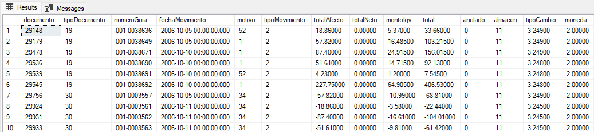
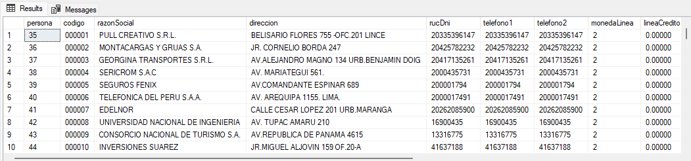

# TAREA 12 😄
## Ejercicios de Consultas SQL
*Ordenar de menor a mayor y dar formato en soles en todas las consulas que tienen un valor en ventas.*

### 1. Total de ventas en el año 2009:

쮺uál es el total de ventas realizadas en el año 2009?
```sql
declare @fecha_inicio_2009 datetime= '2009-01-01'
declare @fecha_fin_2009 datetime = '2009-12-31'

select FORMAT(sum(total),'C', 'es-PE') AS Total_Ventas
from ve.documento
where fechaMovimiento between @fecha_inicio_2009 and @fecha_fin_2009
```


### 2. Personas sin entradas registradas en la tabla personaDestino:
쮺uáles son las personas que no tienen una entrada registrada en la tabla personaDestino?
```sql
select p.*
from ma.persona p
left join ma.personaDestino pd on p.persona = pd.persona
where pd.persona is null
```


### 3. Promedio del monto total de transacciones de ventas:
쮺uál es el promedio del monto total de todas las transacciones de ventas registradas en la base de datos, expresado en moneda local (soles peruanos)?
```sql
select FORMAT(AVG(total), 'C', 'es-PE') AS "Promedio del total de ventas"
from ve.documento
```


### 4. Documentos de ventas con monto total superior al promedio:
Obtén una lista de todos los documentos de ventas cuyo monto total supere el promedio del monto total de todos los documentos de ventas registrados en la base de datos.
```sql
select *
from ve.documento
where total > (select AVG(total) from ve.documento)
ORDER BY documento ASC
```


### 5. Documentos de ventas pagados con una forma de pago específica:
Listar los documentos de ventas que han sido pagados utilizando una forma de pago específica desde la tabla documentoPago.
```sql
select d.*
from ve.documentoPago dp
inner join ve.documento d on dp.documento = d.documento
inner join pa.pago p on dp.pago = p.pago
where p.formaPago = 1
ORDER BY documento ASC
```



### 6.	Detalles de documentos de ventas canjeados:
쮺칩mo se distribuye el saldo total entre los diferentes almacenes, considerando la informaci칩n de los saldos iniciales de inventario en la base de datos?
```sql
SELECT almacen, FORMAT(SUM(costoSoles), 'C', 'es-PE') AS Saldo_Total
FROM ma.saldosIniciales
GROUP BY almacen
ORDER BY SUM(costoSoles) ASC;
```


### 7.	Saldo total distribuido por almacén:
Obtén una lista de todos los documentos de ventas cuyo monto total supere el promedio del monto total de todos los documentos de ventas registrados en la base de datos.
```sql
SELECT *
FROM ve.documento
WHERE total > (SELECT AVG(total)
FROM ve.documento)
ORDER BY documento ASC;
```


### 8.	Detalles de documentos de ventas por vendedor:
쮺uáles son los detalles de los documentos de ventas asociados al vendedor con identificaci칩n n칰mero 3 en la base de datos, considerando la informaci칩n detallada de cada documento en relaci칩n con sus elementos de venta?
```sql
SELECT d.*
FROM ve.documento d
INNER JOIN ve.documentoDetalle dd ON d.documento = dd.documento
WHERE d.vendedor = 3;
```


### 9.	Total de ventas por año y vendedor:
쮺uál es el total de ventas por año y vendedor en la base de datos de ventas, considerando solo aquellos vendedores cuya suma total de ventas en un año específico sea superior a 100,000 unidades monetarias?
```sql
SELECT vendedor, YEAR(fechaMovimiento) AS Anio, FORMAT(SUM(total),'C', 'es-PE') AS Total_Ventas
FROM ve.documento
GROUP BY vendedor, YEAR(fechaMovimiento)
HAVING SUM(total) > 100000
ORDER BY Total_Ventas ASC
```


### 10.	Desglose mensual de ventas por vendedor:
쮺uál es el desglose mensual de las ventas por vendedor en cada año, considerando la suma total de ventas para cada mes y año específico?
```sql
SELECT vendedor, MONTH(fechaMovimiento) AS Anio, FORMAT(SUM(total), 'C', 'es-PE') AS Total_Ventas
FROM ve.documento
GROUP BY vendedor, MONTH(fechaMovimiento)
HAVING SUM(total) > 100000
ORDER BY SUM(total) DESC;
```


### 11.	Clientes que compraron más de 10 veces en un año:
쮺uántos clientes compraron más de 10 veces en un año?
```sql
SELECT persona, YEAR(fechaMovimiento) AS año, COUNT(*) AS Compras
FROM ve.documento
WHERE tipoMovimiento = 1
GROUP BY persona, YEAR(fechaMovimiento)
HAVING COUNT(*) > 10
ORDER BY año ASC
```


### 12.	Total acumulado de descuentos por vendedor:
쮺uál es el total acumulado de descuentos aplicados por cada vendedor en la base de datos de ventas, considerando la suma de los descuentos descto01, descto02 y descto03, y mostrando solo aquellos vendedores cuyo total de descuentos acumulados supere los 5000?
```sql
SELECT vendedor, FORMAT(SUM(descto01 + descto02 + descto03), 'C', 'es-PE') AS Descuentos_Acumulados
FROM ve.documento
GROUP BY vendedor
HAVING SUM(descto01 + descto02 + descto03) > 5000
ORDER BY vendedor ASC;
```


### 13.	Total anual de ventas por persona:
쮺uál es el total anual de ventas realizadas por cada persona en la base de datos de ventas, considerando 칰nicamente los movimientos de tipo venta (tipoMovimiento = 1), y mostrando solo aquellas personas cuyas ventas anuales superen los 10000?
```sql
SELECT persona, YEAR(fechaMovimiento) AS Año, FORMAT(SUM(total),'C', 'es-PE') AS Total_Anual
FROM ve.documento
WHERE tipoMovimiento = 1
GROUP BY persona, YEAR(fechaMovimiento)
HAVING SUM(total) > 10000
ORDER BY Año ASC
```


### 14.	Recuento total de productos vendidos por vendedor:
쮺uál es el recuento total de productos vendidos por cada vendedor en la base de datos de ventas?
```sql
SELECT 
    d.vendedor, 
    COUNT(dd.documentoDetalle) AS Total_Productos_Vendidos
FROM 
    ve.documentoDetalle dd
JOIN 
    ve.documento d ON dd.documento = d.documento
GROUP BY 
    d.vendedor
ORDER BY Total_Productos_Vendidos ASC
```


### 15.	Ventas mensuales desglosadas por tipo de pago:
쮺uánto se vendi칩 cada mes del año 2009, desglosado por tipo de pago?
```sql
SELECT 
    MONTH(d.fechaMovimiento) AS Mes,
    p.formaPago,
    FORMAT(SUM(d.total),'C', 'es-PE') AS Total_Ventas
FROM 
    ve.documento d
JOIN 
    pa.pago p ON d.vendedor = p.vendedor
WHERE 
    YEAR(d.fechaMovimiento) = 2009
GROUP BY 
    MONTH(d.fechaMovimiento),
    p.formaPago
ORDER BY Mes ASC
```


### 16.	Total de ventas en el año 2007:
쮺uál es el total de ventas realizadas en el año 2007?
```sql
declare @fecha_inicio_2007 datetime= '2007-01-01'
declare @fecha_fin_2007 datetime = '2007-12-31'

select FORMAT(sum(total),'C', 'es-PE') AS Total_Ventas
from ve.documento
where fechaMovimiento between @fecha_inicio_2007 and @fecha_fin_2007
```


### 17.	Personas sin entradas registradas en la tabla personaDestino en el año 2008:
쮺uáles son las personas que no tienen una entrada registrada en la tabla personaDestino en el año 2008?
```sql
DECLARE @fecha_inicio_2008 DATETIME = '2008-01-01';

SELECT p.*
FROM ma.persona p
LEFT JOIN ma.personaDestino pd ON p.persona = pd.persona AND YEAR(@fecha_inicio_2008) = 2008
WHERE pd.persona IS NULL;
```



### 18.	Promedio del monto total de transacciones de ventas en el año 2009:
쮺uál es el promedio del monto total de todas las transacciones de ventas registradas en la base de datos en el año 2009, expresado en moneda local (soles peruanos)?
```sql
SELECT FORMAT(AVG(total), 'C', 'es-PE') AS "Promedio del total de ventas"
FROM ve.documento
WHERE YEAR(fechaMovimiento) = 2009;
```


### 19.	Documentos de ventas con monto total superior al promedio en el año 2005:
Obtén una lista de todos los documentos de ventas cuyo monto total supere el promedio del monto total de todos los documentos de ventas registrados en la base de datos en el año 2005.
```sql
SELECT *
FROM ve.documento
WHERE total > (
    SELECT AVG(total)
    FROM ve.documento
    WHERE YEAR(fechaMovimiento) = 2005
)
ORDER BY documento ASC
```


### 20.	Documentos de ventas pagados con una forma de pago específica en el año 2006:
Listar los documentos de ventas que han sido pagados utilizando una forma de pago específica desde la tabla documentoPago en el año 2006.
```sql
SELECT d.*
FROM ve.documento d
JOIN pa.pago p ON d.vendedor = p.vendedor
WHERE YEAR(d.fechaMovimiento) = 2006 AND p.formaPago = 1;
```


### 21.	Detalles de documentos de ventas canjeados en el año 2007:
쮺칩mo se distribuye el saldo total entre los diferentes almacenes, considerando la informaci칩n de los saldos iniciales de inventario en la base de datos en el año 2007?
```sql
DECLARE @fecha_inicio_2007 DATETIME = '2007-01-01';

SELECT almacen, FORMAT(SUM(costoSoles), 'C', 'es-PE') AS Saldo_Total
FROM [ma].[saldosIniciales]
WHERE YEAR(@fecha_inicio_2007) = 2007 GROUP BY almacen
ORDER BY almacen
```


### 22.	Saldo total distribuido por almacén en el año 2008:
Obtén una lista de todos los documentos de ventas cuyo monto total supere el promedio del monto total de todos los documentos de ventas registrados en la base de datos en el año 2008.
```sql
SELECT *
FROM ve.documento
WHERE total > (SELECT AVG(total)
FROM ve.documento
WHERE YEAR(fechaMovimiento) = 2008);
```


### 23.	Detalles de documentos de ventas por vendedor en el año 2009:
쮺uáles son los detalles de los documentos de ventas asociados al vendedor con identificaci칩n n칰mero 3 en la base de datos en el año 2009, considerando la informaci칩n detallada de cada documento en relaci칩n con sus elementos de venta?
```sql
SELECT d.*
FROM ve.documento d
JOIN ve.documentoDetalle dd
ON d.documento = dd.documento
WHERE d.vendedor = 3;
```


### 24.	Total de ventas por año y vendedor en el año 2008:
쮺uál es el total de ventas por año y vendedor en la base de datos de ventas, considerando solo aquellos vendedores cuya suma total de ventas en el año 2008 sea superior a 100,000 unidades monetarias?
```sql
SELECT vendedor, YEAR(fechaMovimiento) AS Año, FORMAT(SUM(total),'C', 'es-PE') AS Total_Ventas
FROM ve.documento
WHERE YEAR(fechaMovimiento) = 2008
GROUP BY vendedor, YEAR(fechaMovimiento)
HAVING SUM(total) > 100000
ORDER BY vendedor ASC
```


### 25.	Desglose mensual de ventas por vendedor en el año 2009:
쮺uál es el desglose mensual de las ventas por vendedor en cada año, considerando la suma total de ventas para cada mes y año específico en el año 2009?
```sql
SELECT vendedor, MONTH(fechaMovimiento) AS Mes, FORMAT(SUM(total), 'C', 'es-PE') AS Total_Ventas
FROM ve.documento
WHERE YEAR(fechaMovimiento) = 2009
GROUP BY vendedor, MONTH(fechaMovimiento)
ORDER BY Total_Ventas ASC
```


### 26.	Clientes que compraron más de 10 veces en un año en el año 2005:
쮺uántos clientes compraron más de 10 veces en un año en el año 2005?
```sql
SELECT persona, YEAR(fechaMovimiento) AS Año, COUNT(*) AS Compras
FROM ve.documento
WHERE tipoMovimiento = 1 AND YEAR(fechaMovimiento) = 2005
GROUP BY persona, YEAR(fechaMovimiento) HAVING COUNT(*) > 5;
```


### 27.	Total acumulado de descuentos por vendedor en el año 2006:
쮺uál es el total acumulado de descuentos aplicados por cada vendedor en la base de datos de ventas, considerando la suma de los descuentos descto01, descto02 y descto03, y mostrando solo aquellos vendedores cuyo total de descuentos acumulados supere los 5000 en el año 2005?
```sql
SELECT vendedor, FORMAT(SUM(descto01 + descto02 + descto03),'C', 'es-PE') AS Descuentos_Acumulados
FROM ve.documento
WHERE YEAR(fechaMovimiento) = 2005
GROUP BY vendedor HAVING SUM(descto01 + descto02 + descto03) > 5000
ORDER BY Descuentos_Acumulados ASC
```


### 28.	Total anual de ventas por persona en el año 2007:
쮺uál es el total anual de ventas realizadas por cada persona en la base de datos de ventas, considerando 칰nicamente los movimientos de tipo venta (tipoMovimiento = 1), y mostrando solo aquellas personas cuyas ventas anuales superen los 10000 en el año 2007?
```sql
SELECT persona, YEAR(fechaMovimiento) AS Año, FORMAT(SUM(total),'C', 'es-PE') AS Total_Ventas
FROM ve.documento
WHERE tipoMovimiento = 1 AND YEAR(fechaMovimiento) = 2007
GROUP BY persona, YEAR(fechaMovimiento) HAVING SUM(total) > 10000
ORDER BY Total_Ventas ASC
```


### 29.	Recuento total de productos vendidos por vendedor en el año 2008:
쮺uál es el recuento total de productos vendidos por cada vendedor en la base de datos de ventas en el año 2008?
```sql
SELECT vendedor, COUNT(*) AS Total_Productos_Vendidos
FROM ve.documento
WHERE YEAR(fechaMovimiento) = 2008
GROUP BY vendedor
ORDER BY Total_Productos_Vendidos ASC
```


### 30.	Ventas mensuales desglosadas por tipo de pago en el año 2009:
쮺uánto se vendi칩 cada mes del año 2009, desglosado por tipo de pago?
```sql
SELECT MONTH(fechaMovimiento) AS Mes, p.formaPago, FORMAT(SUM(total),'C', 'es-PE') AS Total_Ventas
FROM ve.documento d
JOIN pa.pago p ON d.vendedor = p.vendedor
WHERE YEAR(fechaMovimiento) = 2009
GROUP BY MONTH(fechaMovimiento), p.formaPago
ORDER BY Mes ASC
```


